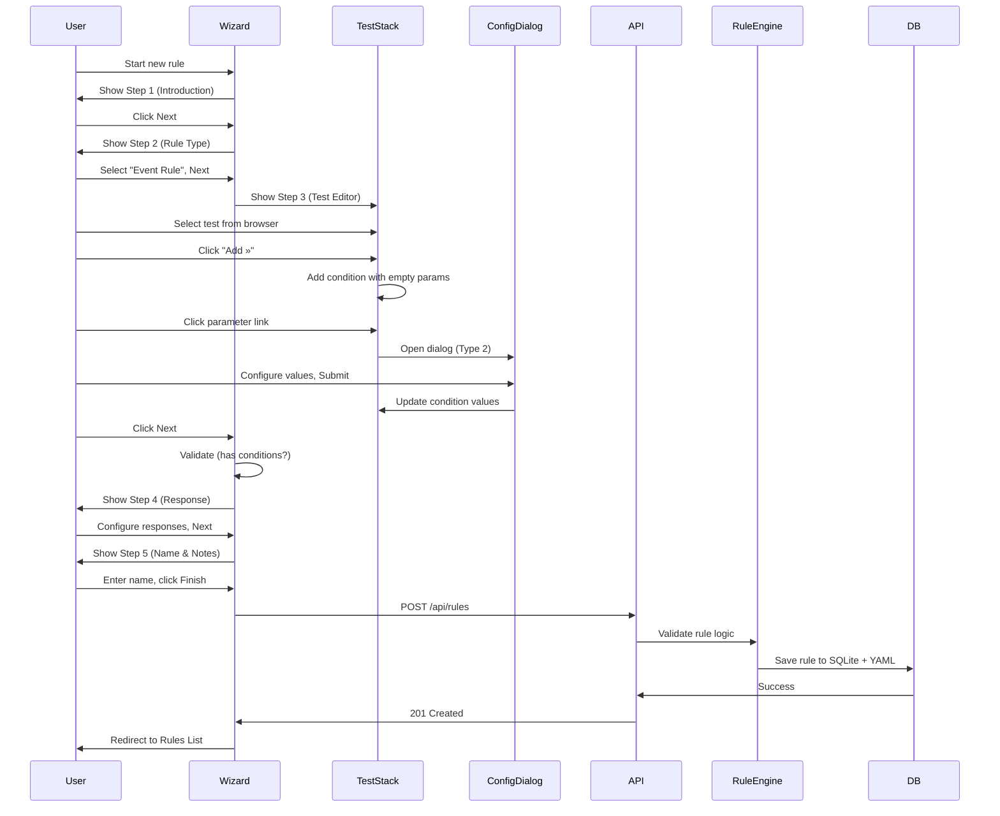
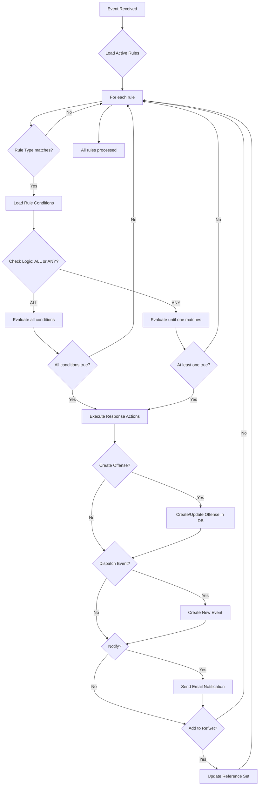
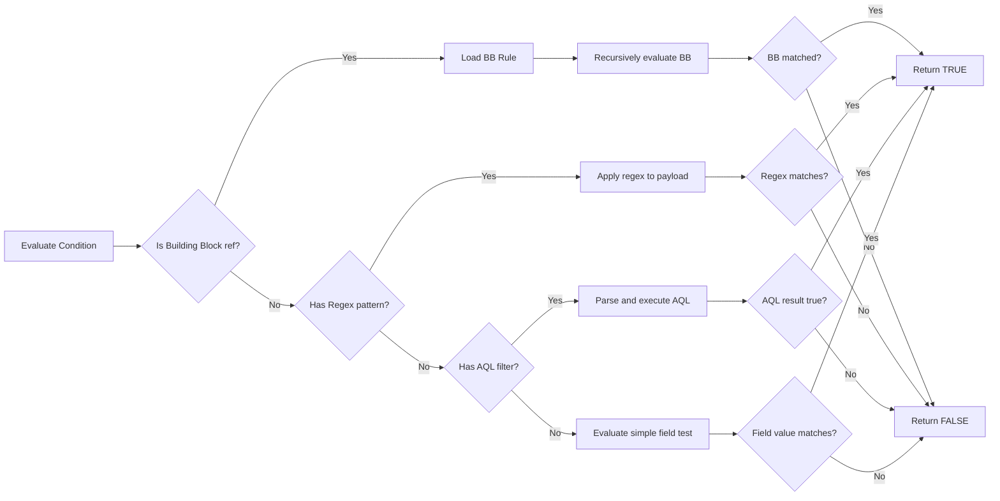
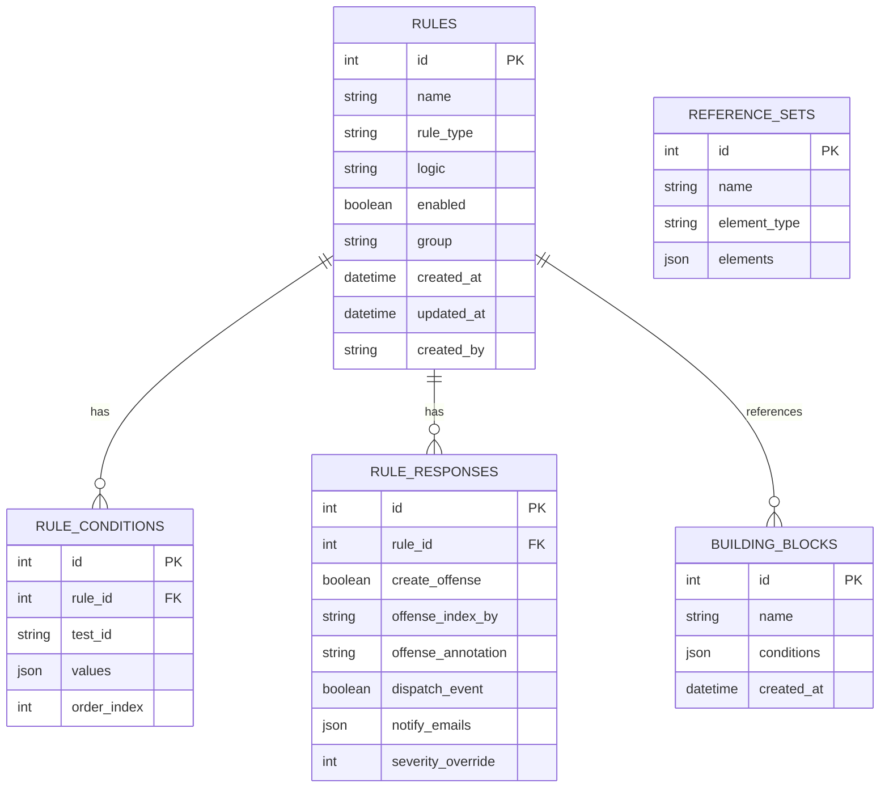
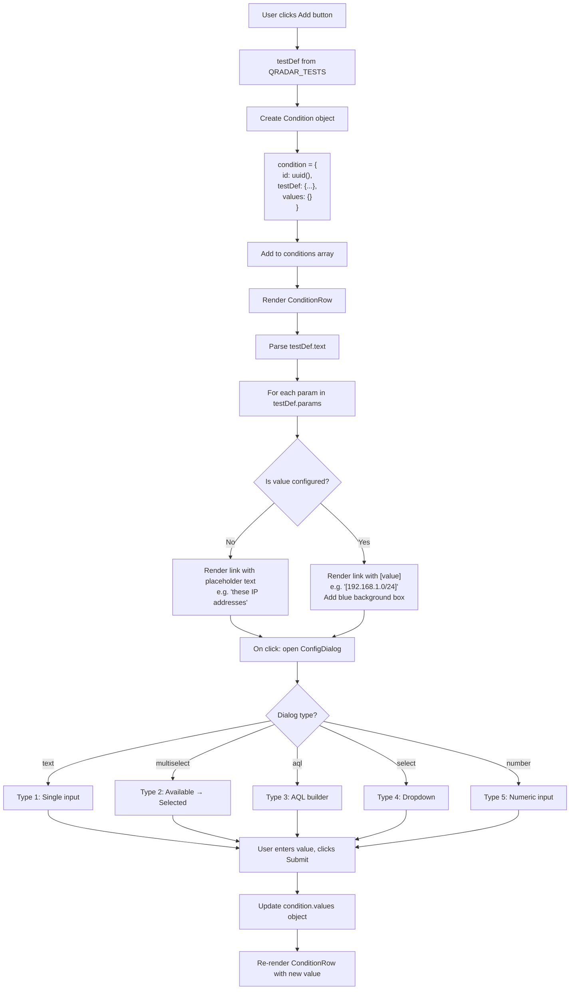
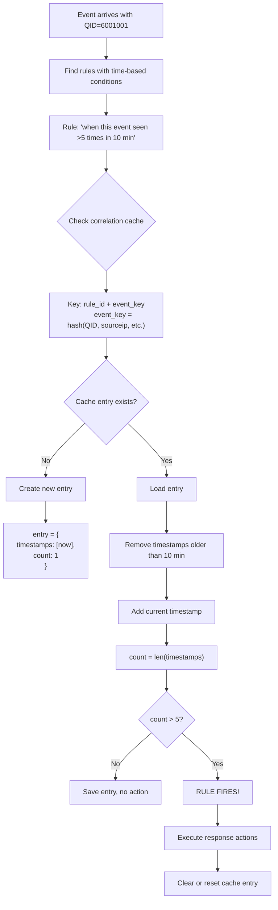

# QRadar SIEM Clone - Data Workflow Diagrams

## 1. Rule Creation Flow (Frontend → Backend)



---

## 2. Rule Evaluation Flow (Runtime)



---

## 3. Condition Evaluation Priority Order



**Priority Order:**
1. **Building Blocks** - Evaluated first, can reference other BBs recursively
2. **Regex Patterns** - Applied to payload/fields
3. **AQL Filters** - Complex queries with WHERE clauses
4. **Simple Field Tests** - Direct comparisons (sourceip, qid, etc.)

---

## 4. Component Interaction Diagram

```mermaid
graph TB
    subgraph Frontend
        A[RuleEditor.tsx]
        B[WizardContainer.tsx]
        C[TestBrowser.tsx]
        D[TestStack.tsx]
        E[ConditionRow.tsx]
        F[ConfigDialog.tsx]
        G[WizardSteps.tsx]
    end
    
    subgraph "Shared State"
        H[Rule State Object]
        I["- name
        - type
        - logic
        - conditions[]
        - response{}
        - enabled"]
    end
    
    subgraph Backend
        J[/api/rules]
        K[rule_engine.py]
        L[evaluator.py]
        M[correlator.py]
        N[aggregator.py]
    end
    
    subgraph Storage
        O[(SQLite DB)]
        P[YAML Files]
        Q[Reference Data]
    end
    
    A --> B
    B --> C
    B --> D
    B --> G
    D --> E
    E --> F
    C --> H
    D --> H
    G --> H
    H --> J
    J --> K
    K --> L
    K --> M
    K --> N
    L --> O
    L --> P
    M --> O
    N --> Q
```

---

## 5. Database Schema



---

## 6. Test Condition Rendering Flow



---

## 7. Building Block Resolution Example

**Scenario:** Main rule references a Building Block

```
Main Rule: "Detect Suspicious Login Attempts"
- Condition 1: when an event matches BB "BB: Failed Login Events"
- Condition 2: when source IP is NOT in reference set "Known_Good_IPs"
- Logic: ALL
- Response: Create offense indexed by Source IP

Building Block: "BB: Failed Login Events"  
- Condition 1: when event QID is one of [5000001, 5000003, 5000015]
- Condition 2: when event severity > 5
- Logic: ALL
- Response: NONE (Building Blocks have no responses)
```

**Evaluation Flow:**
1. Event arrives: `QID=5000001, severity=7, sourceip=10.1.1.50`
2. Main rule evaluates Condition 1
3. Loads BB "BB: Failed Login Events"
4. Evaluates BB Condition 1: QID in [5000001...] → **TRUE**
5. Evaluates BB Condition 2: severity > 5 → **TRUE**
6. BB logic is ALL, both true → **BB MATCHES**
7. Main rule Condition 1 → **TRUE**
8. Main rule evaluates Condition 2
9. Check if 10.1.1.50 in Known_Good_IPs → **NOT FOUND** → **TRUE**
10. Main rule logic is ALL, both true → **RULE FIRES**
11. Execute response: Create offense indexed by sourceip=10.1.1.50

---

## 8. Time-Based Correlation Tracking



**Cache Structure:**
```python
correlation_cache = {
    "rule_123_evt_6001001_10.1.1.5": {
        "timestamps": [
            "2024-02-13T10:25:10",
            "2024-02-13T10:26:45",
            "2024-02-13T10:28:30",
            "2024-02-13T10:29:15",
            "2024-02-13T10:30:20",
            "2024-02-13T10:31:05"  # 6th event - FIRES!
        ],
        "count": 6,
        "last_updated": "2024-02-13T10:31:05"
    }
}
```

---

## Implementation Notes

### Critical Data Structures

**Frontend State (React):**
```typescript
interface RuleState {
    name: string;
    ruleType: 'event' | 'flow' | 'common' | 'offense' | 'building_block';
    logic: 'ALL' | 'ANY';
    conditions: Condition[];
    response: RuleResponse;
    enabled: boolean;
    group: string;
    notes?: string;
}

interface Condition {
    id: string;  // UUID
    testDef: QRadarTest;  // Reference to test template
    values: Record<string, any>;  // Configured parameter values
}
```

**Backend Models (Python):**
```python
class Rule(BaseModel):
    id: int
    name: str
    rule_type: str
    logic: str
    conditions: List[RuleCondition]
    response: RuleResponse
    enabled: bool = True
    group: str = "Other"
    created_at: datetime
    updated_at: datetime
    created_by: str

class RuleCondition(BaseModel):
    test_id: str  # References QRADAR_TESTS[id]
    values: Dict[str, Any]  # Configured values
    order_index: int
```

### Data Persistence

**Two-layer storage:**
1. **SQLite Database** - Structured data, fast queries
2. **YAML Files** - Human-readable backups, version control friendly

**Sync strategy:**
- All writes go to both DB and YAML
- On startup, DB is source of truth
- YAML acts as backup and export format

This workflow ensures data integrity and provides easy export/import capabilities.
